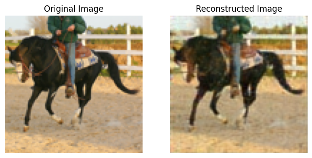
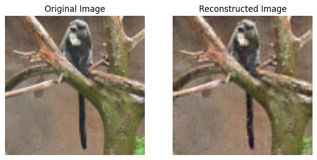
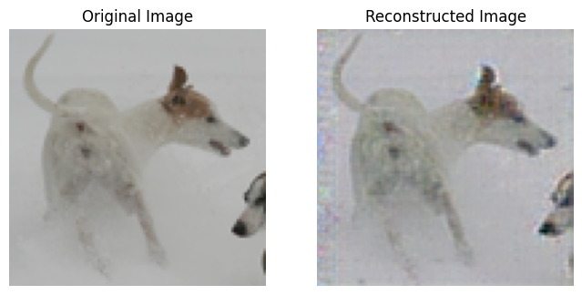
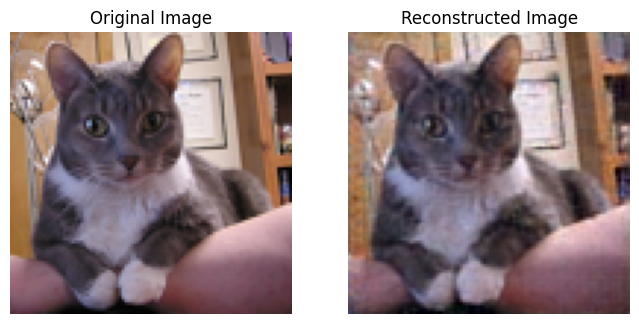
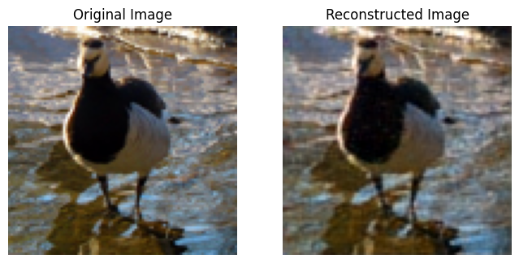
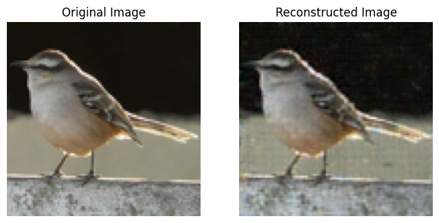

# 🧠 Deep Convolutional Autoencoder (DCAE) untuk Kompresi dan Rekonstruksi Gambar

Proyek ini mengimplementasikan Deep Convolutional Autoencoder (DCAE) dengan arsitektur yang kompleks, memanfaatkan residual connections dan operasi transformasi dimensi khusus seperti space-to-channel dan channel-to-space. Model ini terdiri dari encoder yang mentransformasikan gambar input 3-channel melalui blok downsampling residual ke representasi latent 16-channel, serta decoder yang merekonstruksi gambar asli melalui blok upsampling residual. Dioptimalkan menggunakan optimizer SOAP dengan L1 loss untuk mempertahankan detail visual, model ini dilatih selama 40 epoch untuk tujuan kompresi gambar yang efisien sekaligus mempertahankan fitur penting dalam rekonstruksi.

---

## 📁 Dataset

Dataset menggunakan data loader dari PyTorch (CIFAR-10)

---

## 🧬 Arsitektur 

### Encoder

#### Lapisan Awal
- Conv2D (16 filters, 3x3)

#### Downsample Block 1
- GroupNorm + SiLU + Conv2D (16→32 filters, 3x3, stride=2) + Dropout
- GroupNorm + SiLU + Conv2D (32→32 filters, 3x3, stride=2) + Dropout
- Jalur residual: Space-to-channel + AvgPool2D (scale=2)

#### Middle Stage
- Residual Block: GroupNorm + SiLU + Conv2D (32→32 filters) + Dropout + GroupNorm + SiLU + Conv2D (32→32 filters) + Dropout
- Residual Block: GroupNorm + SiLU + Conv2D (32→16 filters) + Dropout + GroupNorm + SiLU + Conv2D (16→16 filters) + Dropout
- Jalur shortcut: GroupNorm + SiLU + Conv2D (32→16 filters) + Dropout

### Latent Space
- 16 channel feature maps dengan dimensi tereduksi (1/4 dari input asli)

### Decoder

#### Middle Stage
- Residual Block: GroupNorm + SiLU + Conv2D (16→32 filters) + Dropout + GroupNorm + SiLU + Conv2D (32→32 filters) + Dropout
- Residual Block: GroupNorm + SiLU + Conv2D (32→32 filters) + Dropout + GroupNorm + SiLU + Conv2D (32→32 filters) + Dropout
- Jalur shortcut: GroupNorm + SiLU + Conv2D (16→32 filters) + Dropout

#### Upsample Block 1
- GroupNorm + SiLU + ConvTranspose2D (32→16 filters, stride=2) + Dropout
- GroupNorm + SiLU + ConvTranspose2D (16→16 filters, stride=2) + Dropout
- Jalur residual: Channel-to-space + Upsample (scale=2)

#### Lapisan Akhir
- GroupNorm + SiLU + Conv2D (16→3 filters, 3x3)

---

## 📊 Hasil Training

Model dilatih selama 40 epoch menggunakan L1 Loss (Mean Absolute Error) dan optimizer `SOAP`.

| Epoch |   Loss     | 
|-------|------------|
| 1     | 1.3425     | 
| 10    | 0.0760     |
| 25    | 0.0641     |
| 40    | 0.0602     | 

---

## 🖼️ Contoh Input dan Output

Berikut perbandingan antara original image dan reconstructed image:

---

